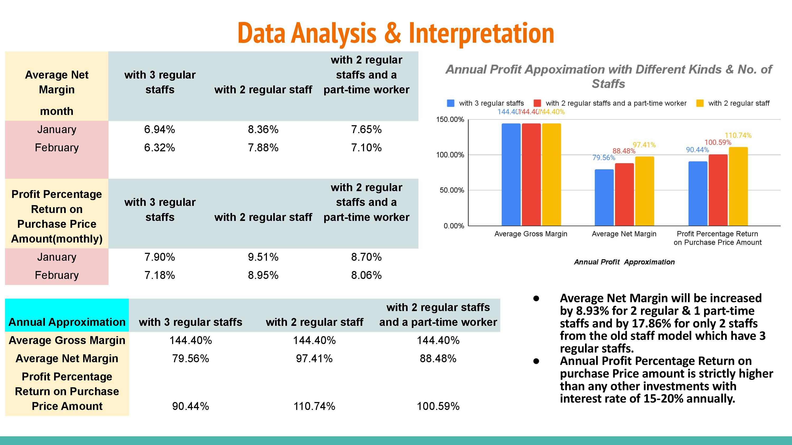
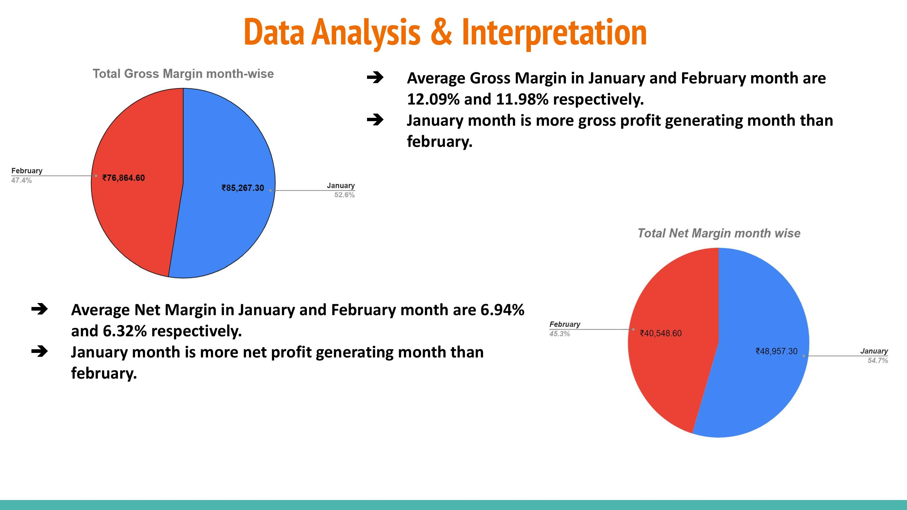

# Urban-Shop-Data-Analysis

## Project Description
In this project, raw and real-time data was collected from a nearby local shop. The data was then preprocessed and cleaned using course knowledge. The cleaned data was then analyzed using Google Sheets to gain insights into the shop's growth, future possibilities, improvement factors, and suggestions for further development.

## Data Collection
The data was collected from the nearby local shop, capturing various aspects such as sales, customer demographics, inventory, and other relevant metrics. The collection process involved extracting data from receipts, manual entries, and other sources available at the shop.

## Data Preprocessing
The collected data underwent preprocessing to ensure its quality and suitability for analysis. This step involved cleaning the data by removing any inconsistencies, errors, or missing values. Additionally, the data was transformed and formatted appropriately for analysis purposes.

## Data Analysis
Google Sheets was used as the primary tool for data analysis. The preprocessed data was imported into Google Sheets, and various statistical and analytical techniques were applied to gain insights. The analysis focused on identifying trends, patterns, and correlations within the data to understand the shop's growth potential and areas for improvement.

## Presentation
The analysis results were visualized and presented using slides. The presentation aimed to provide a clear overview of the shop's current performance, growth trajectory, and potential opportunities. It included graphs, charts, and key findings to effectively communicate the analysis outcomes.

## Sample Screenshots
<table align="center">
  <tr>
    <td></td>
  </tr>
  <tr>
    <td></td>
  </tr>
</table>

## Conclusion
This project involved the collection, preprocessing, and analysis of raw and real-time data from a local shop. By leveraging Google Sheets and employing course knowledge, the data was cleaned, analyzed, and presented to indicate the shop's growth, future possibilities, improvement factors, and suggestions for further development. The project outcomes aim to provide valuable insights for the shop's stakeholders and aid in making informed decisions.

Thank you for viewing this repo! Feel free to reach out with any questions or feedback.

<em style="color: #ff66b2; font-weight: bold;">✨ --- Designed & made with Love by Shib Kumar Saraf ✨</em>
